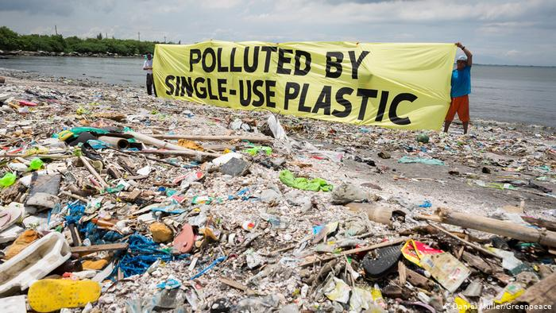

```{r setup, include=FALSE}
knitr::opts_chunk$set(echo = TRUE)
library(ggrepel)
library(janitor)
library(tidyverse)
library(tibble)
library(ggplot2)
library(tidyr)
library(dplyr)
```


## Dataset background

As the world’s population continues to grow, so does the amount of garbage that people produce. On-the-go lifestyles require easily disposable products, such as soda cans or bottles of water. Still, the accumulation of these products has led to increasing amounts of plastic pollution around the world. As plastic is composed of major toxic pollutants, it has the potential to cause significant harm to the environment in the form of air, water, and land pollution.
In our project we’ll analyze   the dataset “Global Plastic Waste” from tidytuesday. This dataset holds data about mismanaged plastic waste, population, GDP per capita of 145 countries.


```{r echo=FALSE}
knitr::include_graphics()
```

## Importing the data into R

The data comes in a CSV files, therefore we'll use read.csv function to import the data into R.


``` {r, echo=TRUE}
coast_vs_waste <- readr::read_csv("https://raw.githubusercontent.com/rfordatascience/tidytuesday/master/data/2019/2019-05-21/coastal-population-vs-mismanaged-plastic.csv")

mismanaged_vs_gdp <- readr::read_csv("https://raw.githubusercontent.com/rfordatascience/tidytuesday/master/data/2019/2019-05-21/per-capita-mismanaged-plastic-waste-vs-gdp-per-capita.csv")

waste_vs_gdp <- readr::read_csv("https://raw.githubusercontent.com/rfordatascience/tidytuesday/master/data/2019/2019-05-21/per-capita-plastic-waste-vs-gdp-per-capita.csv")
```


## Data Dictionary

**Entity** -	Country Name (Character)

**Code** - 3 Letter country code (Character)

**Year** - Year (Integer (date))

**Mismanaged plastic waste (tones)** - Tones of mismanaged plastic waste(double)

**Coastal population** -	Number of individuals living on/near coast (double)

**Total Population** - Total population according to Gapminder(double)

**Per capita mismanaged plastic waste (kg per day)** -	Amount of mismanaged plastic waste per capita in kg/day (double)

**Per capita plastic waste (kg per person per day)** -	Amount of plastic waste per capita in kg/day (double)

**GDP per capita** -	GDP per capita constant 2011 international $, rate (double)

## Tidying the data
Let's take a look at our data set briefly:

``` {r, echo=TRUE}
summary(coast_vs_waste)
summary(mismanaged_vs_gdp)
summary(mismanaged_vs_gdp)
```

As we can see above, there are N/A's values that we need to clean from our data, before we can work on it. 

``` {r, echo=TRUE}
coast_vs_waste <- coast_vs_waste[complete.cases(coast_vs_waste[ , 4:6]),]
mismanaged_vs_gdp <- mismanaged_vs_gdp[complete.cases(mismanaged_vs_gdp[ , 4:6]),]
waste_vs_gdp <- waste_vs_gdp[complete.cases(waste_vs_gdp[ , 4:6]),]
```

Now our data is tidy
``` {r, echo=TRUE}
summary(coast_vs_waste)
summary(waste_vs_gdp)
summary(waste_vs_gdp)
```

Notice that all the data from all the years except for 2010 was swiped out. We assume that the reason that the creators of the dataset chose to add the data from years 1700 - 2009 and 2011-2013 is to show us that the data about plastic pollution in those years is missing and was not collected.


## Transforming and Visualizing

### Correlation between the coastal population and the mismanaged plastic waste
**Hypothesis:**

We assume that as the population in a certain country tends to settle in coastal areas, it is more likely to spend time at the beach (as for recreation or as for livelihood). As a result, it leaves more plastic waste (bottles, plastic cutlery, bags, etc.) in the coastal areas or even throw it into the ocean. That phenomenon makes it very hard to clear the plastic waste and therefore it remains mismanaged.

``` {r, echo=TRUE}
ggplot(data = coast_vs_waste, mapping = aes(x = log(`Coastal population`) , y = log(`Mismanaged plastic waste (tonnes)`))) + 
  geom_point(aes(size=`Total population (Gapminder)`)) + 
  geom_label_repel(data = subset(coast_vs_waste, `Total population (Gapminder)` > 80000000 |`Total population (Gapminder)` < 10000 ), aes(label=Entity),hjust=2, vjust=-1) 
```


We can see in the graph, there is a positive relationship between coastal population and mismanaged plastic waste.
Similar to our assumption.
Also, from the graph we can see that the bigger the country's population is, the more mismanaged plastic waste it has- Because of the simple fact that the more people live in a country, the more waste they make.  


### Correlation between the GDP per capita (in US dollars) and the mismanaged plastic waste per capita
**Hypothesis:**

We assume that the higher the GDP per capita, the smaller the plastic waste mismanaged per capita. This assumption derives from the basic fact that the higher a person's income, the higher the taxes he is required to pay to the authorities. Most modern countries provide sanitation services to their citizens. The bigger the country’s budget - the more efficient its waste management.

``` {r, echo=TRUE}
ggplot(data = mismanaged_vs_gdp, mapping = aes(y = log(`Per capita mismanaged plastic waste (kilograms per person per day)`), x = log(`GDP per capita, PPP (constant 2011 international $) (Rate)`))) + 
  geom_point(aes(size=`Total population (Gapminder)`)) + 
  geom_label_repel(data = subset(mismanaged_vs_gdp, `Total population (Gapminder)` > 80000000 |`Total population (Gapminder)` < 10000 ), aes(label=Entity),hjust=2, vjust=-1)
```

We can see in the graph that our hypothesis is correct only for countries that have log(GDP) > 9.
A possible explanation for this phenomenon is that in low GDP countries the population can't afford to buy a lot of products. Therefore, their plastic waste is smaller than in high GDP countries.

### Correlation between the GDP per capita (in US dollars) and the plastic waste per capita (total plastic waste per capita)
**Hypothesis:**

We assume that the higher the GDP per capita, the smaller the plastic waste tends to be.
This assumption derives from the fact that the higher GDP per capita, the more products it tends to consume. Thus, the plastic waste per capita will grow. Positive correlation.

``` {r, echo=TRUE}
ggplot(data = waste_vs_gdp, mapping = aes(y = log(`Per capita plastic waste (kilograms per person per day)`), x = log(`GDP per capita, PPP (constant 2011 international $) (constant 2011 international $)`))) + 
  geom_point(aes(size=`Total population (Gapminder)`)) + 
  geom_label_repel(data = subset(waste_vs_gdp, `Total population (Gapminder)` > 80000000 |`Total population (Gapminder)` < 10000 ), aes(label=Entity),hjust=2, vjust=-1)
```

We can see in the graph, there is a positive relationship between GDP per capita and plastic waste per capita.
Similar to our assumption.


## Modelling

``` {r, echo=TRUE}
ggplot(data = coast_vs_waste, mapping = aes(x = log(`Coastal population`) , y = log(`Mismanaged plastic waste (tonnes)`))) + 
  geom_point(aes(size=`Total population (Gapminder)`)) + 
  geom_label_repel(data = subset(coast_vs_waste, `Total population (Gapminder)` > 80000000 |`Total population (Gapminder)` < 10000 ), aes(label=Entity),hjust=2, vjust=-1) +
  geom_smooth(method = "lm", colour = "orange", se = TRUE)
```


``` {r, echo=TRUE}
model<-lm(formula =  `Mismanaged plastic waste (tonnes)` ~ `Coastal population`, data = coast_vs_waste) %>%
summary()
```

Linear regression assumptions are:

1. Normality of residuals - ϵi ∼ N(0, σϵ) 

2. Homoscedastity - no matter the x_i, the residual distribution is the same


First we'll check the normality of residuals assumption:
``` {r, echo=TRUE}
qqnorm(scale(resid(model))) 
abline(0,1)
```

We can see that the residuals aren’t normally distributed- the errors does not merge with the normality line.

Second we'll check the homoscedastity assumption:
``` {r, echo=TRUE}
plot(resid(model) ~ coast_vs_waste$`Coastal population`) + abline(h = 0, col = 2)
```

We can see that the residual distribution isn't the same for each x_i - the scatter of errors increases.  

Because the linear regression assumptions are not met, we can't infer that there is a linear correlation between coastal population and mismanaged plastic waste.

## Summary

Plastic pollution is a major and growing problem, negatively affecting oceans and wildlife and human health.
In our project we came to know about the size of the global plastic pollution problem, by country. 
We have seen that plastic pollution varies between countries and is affected by the level of GDP per capita - for extreme GDPs (very high or very low) we expect a low amount of mismanaged plastic as opposed to an average GDP for which the amount of mismanaged plastic will be high.
In our project we examined the relationship between the coastal population and mismanaged plastics by linear regression, however since the regression assumptions did not hold, we could not conclude a relationship between the two.

(!) its important to mention that this theory is based on the graphic output only, and it wasn't tested statistically

## References

1. https://github.com/rfordatascience/tidytuesday/tree/master/data/2019/2019-05-21
2. https://www.conserve-energy-future.com/causes-effects-solutions-of-plastic-pollution.php
3. https://ourworldindata.org/plastic-pollution


```{r echo=FALSE, out.width = '50%'}
knitr::include_graphics()
```
